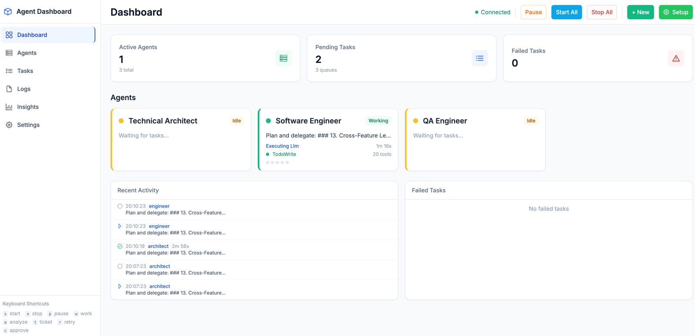

# Agent Framework

Autonomous software engineering team powered by Claude. Three agents — Architect, Engineer, QA — plan, implement, review, and ship code with zero human intervention.



## How It Works

```
You describe what to build
  │
  ▼
Architect plans and breaks down work
  │
  ▼
Engineer implements ──► QA reviews ──► PR created
       ▲                    │
       └── needs fix ───────┘
```

Tasks flow through a configurable workflow DAG. The default chain:

**plan → implement → QA review → create PR**

A `preview` workflow adds extra gates: **plan → preview → preview review → implement → code review → QA review → create PR**.

Each step is a separate Claude Code session with structured context passed between steps via an append-only chain state file. When QA finds issues, the task loops back to the engineer automatically. After `MAX_DAG_REVIEW_CYCLES` bounces, it escalates to the Architect for replanning.

## Quick Start

```bash
pip install -e .

cp config/agent-framework.yaml.example config/agent-framework.yaml
# Edit to add your repositories (see Configuration below)
```

Build MCP servers for real-time JIRA/GitHub access during agent execution:

```bash
cd mcp-servers/jira && npm install && npm run build && cd ../..
cd mcp-servers/github && npm install && npm run build && cd ../..

# Optional: JIRA + GitHub credentials
cp .env.example .env  # Edit with your tokens

# Validate setup
agent doctor
```

### Start Working

```bash
agent up              # Start agents + dashboard, open browser
agent work
# > What would you like to work on? Add retry logic to the payment webhook handler
# > Which repository? your-org/your-repo

agent down            # Tear down when done
```

The framework queues a planning task to the Architect, who chains through Engineer and QA — all locally via file-based queues.

### JIRA Integration (Optional)

```bash
agent work --epic PROJ-100 --parallel   # Process all tickets in an epic
agent run PROJ-123                      # Work a single ticket
agent run PROJ-123 --agent engineer     # Skip planning, go straight to implementation
agent summary --epic PROJ-100           # Progress report with PR links
```

Repos without a `jira_project` configured use local-only task tracking — same workflow pipeline, just no JIRA sync.

## Team Mode

Team mode uses Claude Agent Teams to run multi-agent workflows in a single session instead of serial queue hops.

### Autonomous Teams

Enable in config:

```yaml
team_mode:
  enabled: true
```

| Workflow | Lead | Teammates |
|----------|------|-----------|
| `simple` | engineer | — |
| `standard` | engineer | QA |
| `full` | architect | engineer, QA |

### Interactive Teams

```bash
agent team start --template full --repo owner/repo
agent team start --template full --repo owner/repo --epic ME-443
agent team start --template review --repo owner/repo
agent team escalate TASK-ID
```

Templates: `full` (Architect + Engineer + QA), `review` (QA + Security + Performance), `debug` (2 investigators).

## Architecture

```
src/agent_framework/
├── core/           Agent loop, prompt builder, workflow router, chain state,
│                   error recovery, review cycles, budget manager, orchestrator
├── workflow/       DAG executor, conditions, step routing
├── cli/            CLI commands, TUI dashboard, team commands
├── analytics/      Per-task metrics: agentic, chain, git, LLM, decomposition,
│                   performance, waste, review cycles, verdicts
├── llm/            Claude CLI backend, LiteLLM backend, model routing
├── memory/         Cross-task learning: memory store, tool pattern analysis
├── queue/          File-based task queues with atomic locking
├── integrations/   JIRA and GitHub clients
├── safeguards/     Circuit breaker, watchdog, escalation
├── sandbox/        Test runners (pytest, jest, rspec), static analysis, Docker
├── indexing/       Codebase indexing and semantic search
├── workspace/      Multi-repo workspace management
├── web/            Dashboard (FastAPI + Vue.js)
└── utils/          Subprocess, error handling, validation, atomic IO, cascades
```

### Agents

| Agent | Role | Permissions |
|-------|------|-------------|
| **Architect** | Plans work, breaks down large tasks, reviews architecture, creates PRs | JIRA create, commit, PR |
| **Engineer** | Implements code, writes tests, fixes review feedback | commit, PR |
| **QA** | Linting, testing, security scanning, code review | PR |

### Workflow DAG

Workflows are defined as directed acyclic graphs with conditional edges in `config/agent-framework.yaml`:

```yaml
workflows:
  default:
    start_step: plan
    steps:
      plan:
        agent: architect
        next: [{ target: implement }]
      implement:
        agent: engineer
        next: [{ target: qa_review }]
      qa_review:
        agent: qa
        next:
          - { target: create_pr, condition: approved, priority: 10 }
          - { target: implement, condition: needs_fix, priority: 5 }
      create_pr:
        agent: architect
        task_type: pr_request
```

A `preview` workflow is also included — engineer produces a read-only execution plan that the architect approves before any code is written.

### Task Decomposition

Tasks estimated at >350 lines are automatically decomposed into subtasks (or 6+ discrete deliverables at >=200 lines). Each subtask runs independently; a fan-in task collects results and flows through the review chain. The fan-in creates a single PR for the entire decomposed task.

### Chain State

Each workflow chain maintains an append-only state file at `.agent-communication/chain-state/{root_task_id}.json`. Step records capture the plan, files modified, verdict, and findings — giving downstream agents structured context about what happened upstream.

Upstream context is resolved via a priority cascade:
1. Rejection feedback (direct fix instructions)
2. Chain state (structured step records)
3. Structured findings (file-grouped QA checklist)
4. Upstream summary (legacy inline context)

### Safeguards

Three ceilings prevent runaway loops:
- **MAX_CHAIN_DEPTH = 10** — per-chain step limit
- **MAX_DAG_REVIEW_CYCLES = 2** — QA ↔ engineer bounce cap
- **MAX_GLOBAL_CYCLES = 15** — absolute ceiling across escalations

Additional safety:
- Circuit breaker with configurable health thresholds
- Task-type-specific timeouts (1h for implementation, 30m for testing, 15m for docs)
- Watchdog auto-restart for dead agents
- Stale lock recovery
- Queue size and task age limits

### Observability

Every task produces a structured session log at `logs/sessions/{task_id}.jsonl` with prompt builds, tool calls, LLM completions, cost tracking, and context budget events.

Analytics collectors aggregate session logs into Pydantic reports:

| Collector | Measures |
|-----------|----------|
| `agentic_metrics` | Memory recall, tool usage patterns, context budget, upstream cascade |
| `chain_metrics` | Step success rates, duration p50/p90, retry patterns |
| `git_metrics` | Commits, lines changed, push rates, edit-to-commit latency |
| `llm_metrics` | Cost per task/model, token efficiency, latency percentiles |
| `decomposition_metrics` | Decomposition rate, estimation accuracy, fan-in reliability |
| `performance_metrics` | Agent success/retry rates, completion times |
| `waste_metrics` | Duplicate reads, exploration waste, tool call efficiency |

The web dashboard surfaces these via an Insights page.

### MCP Integration

Agents access JIRA and GitHub in real-time during execution via Model Context Protocol servers:

- **JIRA** — search, create, transition, and comment on tickets
- **GitHub** — create branches, commit, push, create/comment on PRs

A read-cache MCP server deduplicates file reads across workflow steps.

## CLI Reference

### Core

| Command | Description |
|---------|-------------|
| `agent work` | Interactive: describe goal, pick repo |
| `agent work --epic PROJ-100 --parallel` | Process all tickets in an epic |
| `agent run PROJ-123` | Work a single JIRA ticket |
| `agent pull --project PROJ` | Pull unassigned tickets from JIRA backlog |

### Operations

| Command | Description |
|---------|-------------|
| `agent up` | Start agents + dashboard, open browser |
| `agent down` | Stop everything |
| `agent start --replicas 4` | Start N replicas per agent type |
| `agent pause` / `agent resume` | Pause/resume processing |
| `agent status --watch` | Live terminal dashboard |
| `agent retry PROJ-104` | Retry a failed task |
| `agent retry --all` | Retry all failed tasks |

### Teams

| Command | Description |
|---------|-------------|
| `agent team start -t full -r owner/repo` | Launch interactive team |
| `agent team start -t full -r owner/repo -e PROJ-100` | Team with epic context |
| `agent team escalate TASK-ID` | Debug a failed task |
| `agent team status` | List active sessions |

### Analysis

| Command | Description |
|---------|-------------|
| `agent doctor` | Validate config and connectivity |
| `agent analyze --repo owner/repo` | Scan repo for issues |
| `agent dashboard` | Web dashboard with setup wizard |
| `agent check --fix` | Circuit breaker checks, auto-fix |

## Configuration

### `config/agent-framework.yaml`

Not tracked by git. Copy the example to start:

```bash
cp config/agent-framework.yaml.example config/agent-framework.yaml
```

Key sections:

```yaml
# Add repos you want agents to work on
repositories:
  - github_repo: your-org/your-app
    display_name: Your App
  - github_repo: your-org/another-repo
    jira_project: PROJ           # optional
    display_name: Another Repo

# LLM backend
llm:
  mode: claude_cli               # or "litellm" for API calls
  claude_cli_default_model: claude-sonnet-4-5-20250929
  use_mcp: true

# Team mode
team_mode:
  enabled: true
```

See the example file for all options including timeouts, safeguards, analytics, memory, and self-evaluation settings.

### `config/agents.yaml`

Defines agent roles, prompts, and permissions. Prompts reference documentation in `config/docs/` rather than duplicating it inline.

### `.env` (Optional)

Only needed for JIRA/GitHub MCP:

```
JIRA_SERVER=https://your-org.atlassian.net
JIRA_EMAIL=your@email.com
JIRA_API_TOKEN=your-token
GITHUB_TOKEN=your-github-token
```

## Troubleshooting

```bash
agent doctor              # Check config, credentials, connectivity
agent check --fix         # Safety checks with auto-fix
```

| Problem | Fix |
|---------|-----|
| Tasks stuck | Agents auto-recover orphaned tasks on next poll cycle |
| Stale locks | Watchdog auto-cleans, or `rm -rf .agent-communication/locks/*.lock` |
| Agents not responding | `agent down && agent up` |
| JIRA auth failed | New token at https://id.atlassian.com/manage-profile/security/api-tokens |
| GitHub auth failed | New token at https://github.com/settings/tokens (needs `repo` scope) |

See [docs/TROUBLESHOOTING.md](docs/TROUBLESHOOTING.md) for more.

## Development

```bash
pip install -e ".[dev]"
pytest tests/ -v
```

Python 3.10+ required. Uses `setuptools` for builds, `ruff` for linting, `mypy` for type checking.
